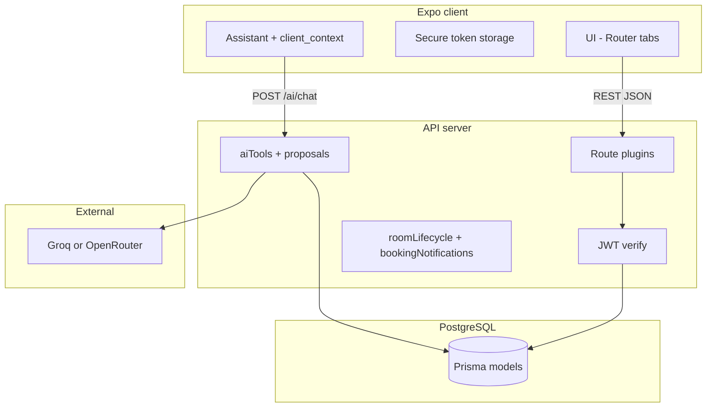
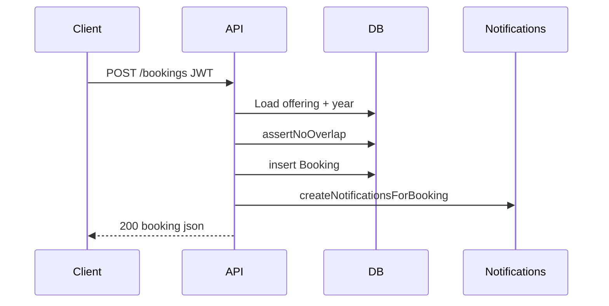

# Open Class - System Documentation (Specification)

| Field | Value |
|-------|--------|
| **Product** | Open Class |
| **Kind** | System specification (requirements, behavior, data, API, security) |
| **Primary audience** | Reviewers, auditors, technical leads, implementers |
| **Implementation reference** | `server/prisma/schema.prisma`, `server/src/`, `lecture-room-status/` |
| **Companion** | Repository root `README.md` (setup, env vars, quick start) |
| **Document version** | 3.0 |

---

## Table of contents

**Part A - Foundation**

1. [Conventions and normative language](#1-conventions-and-normative-language)  
2. [Executive summary](#2-executive-summary)  
3. [Problem domain and motivation](#3-problem-domain-and-motivation)  
4. [Goals and success criteria](#4-goals-and-success-criteria)  
5. [Scope, assumptions, and constraints](#5-scope-assumptions-and-constraints)  
6. [Stakeholders and personas](#6-stakeholders-and-personas)  

**Part B - Roles and behavior**

7. [Roles, permissions, and authorization model](#7-roles-permissions-and-authorization-model)  
8. [Use case catalog](#8-use-case-catalog)  
9. [Functional requirements by domain](#9-functional-requirements-by-domain)  
10. [Room status lifecycle (formal)](#10-room-status-lifecycle-formal)  
11. [Booking rules (detailed)](#11-booking-rules-detailed)  
12. [Notifications engine](#12-notifications-engine)  
13. [Room alert subscriptions](#13-room-alert-subscriptions)  

**Part C - AI and integration**

14. [Campus Assistant (deep specification)](#14-campus-assistant-deep-specification)  

**Part D - Technical design**

15. [System architecture](#15-system-architecture)  
16. [Data model and dictionary](#16-data-model-and-dictionary)  
17. [REST API catalog](#17-rest-api-catalog)  
18. [Mobile client mapping](#18-mobile-client-mapping)  

**Part E - Quality and operations**

19. [Security and threat considerations](#19-security-and-threat-considerations)  
20. [Time, timezone, and consistency](#20-time-timezone-and-consistency)  
21. [Deployment, configuration, and demo data](#21-deployment-configuration-and-demo-data)  
22. [Non-functional requirements](#22-non-functional-requirements)  
23. [Verification, testing, and acceptance](#23-verification-testing-and-acceptance)  
24. [Glossary](#24-glossary)  
25. [Out of scope and roadmap](#25-out-of-scope-and-roadmap)  
26. [Document history](#26-document-history)

---

# Part A - Foundation

## 1. Conventions and normative language

- **Must** / **must not**: contractual behavior; non-conformance is a defect.  
- **Should** / **should not**: strong recommendation; may be waived with documented rationale.  
- **May**: optional capability.  
- **Implementation note**: ties text to the current stack (PostgreSQL, Prisma, Fastify, Expo); if the stack changes, this section needs a pass.  
- **CR** (class representative): always a **student** account (`User.role = student`) plus an active `CrAssignment` for the active academic year. There is **no** `cr` value in the `Role` enum.

---

## 2. Executive summary

Open Class is a **campus operations** product: it gives everyone who depends on physical teaching space a **single, authoritative, time-based picture** of **which rooms are in use, by whom, and when**, and it lets **authorized** staff and class representatives **reserve** that time against **real course offerings** so conflicts are detected **before** people arrive at the door.

The system comprises:

1. A **PostgreSQL** database holding org structure, rooms, academic years, catalog courses, offerings, bookings, notifications, optional room-alert subscriptions, and assistant proposals.  
2. A **Fastify** REST API with **JWT** authentication, **Zod**-validated inputs, and **role-scoped** business rules.  
3. An **Expo** mobile application (tabs: Explore, Schedule, Assistant, Alerts, Profile; conditional Admin).  
4. An optional **Campus Assistant**: an LLM-backed, **tool-using** agent that reads the same data through **server-enforced** APIs and proposes **mutations** only as **confirmable proposals**.

Unlike a static room directory or a generic “facility” spreadsheet, Open Class binds **schedule** to **cohort** (department, year, section) and **offering**, so notifications and visibility can target the **right students and teachers** for each booking.

---

## 3. Problem domain and motivation

### 3.1 Institutional friction (semester operations)

Universities run on **shared scarce resources** (rooms). When state is fragmented:

- **Search cost**: staff and students lose time finding a room or confirming a last-minute change.  
- **Communication lag**: room changes propagate through informal channels; **late arrivals** and **wrong room** incidents increase.  
- **Ambiguous occupancy**: a room looks empty but is **reserved** imminently; informal study use creates **avoidable conflict**.  
- **Double booking**: without a single **overlap-checked** ledger, two groups can believe they own the same slot.

### 3.2 Intensive and short-horizon events (labs, workshops, hackathons)

The same failure mode appears **compressed in time**: many participants, **few suitable rooms** (labs, power, capacity), **rapid changes**, and **no shared live schedule**. Organizers and participants spend effort **negotiating space** instead of delivering the program. Even well-run events can stumble when **lab sessions** or **parallel tracks** lack a **single place** to see **who booked which room and when**.

Open Class is designed for **semester-long teaching** first, but its model (booked intervals, cohort-linked offerings, mobile visibility) applies to **any** environment where **room-time is contested** and must be **published** and **enforced by policy**.

### 3.3 What Open Class changes

| Before | After |
|--------|--------|
| Tribal knowledge, chats, phone | One **queryable** schedule tied to offerings |
| “Is this room free?” guessed from emptiness | **Green / yellow / red** style state from **bookings** |
| Ad-hoc double booking | **409** overlap rejection on create |
| Who to notify unclear | **Cohort + teacher** fan-out from offering |

---

## 4. Goals and success criteria

| ID | Goal | Measurable indicator |
|----|------|----------------------|
| G1 | **Single source of truth** for room occupancy by time | All clients display bookings from same API/DB |
| G2 | **No silent double booking** | Server rejects overlapping `booked` rows for same room |
| G3 | **Correct audience** for class-related alerts | Notifications created for students matching offering cohort + assigned teacher |
| G4 | **Least privilege** | Students cannot create bookings; CR scope enforced |
| G5 | **Operational clarity on mobile** | Explore + Schedule + building search usable without desktop |
| G6 | **Assistant does not bypass RBAC** | Tool calls and confirms use same user id as REST |

---

## 5. Scope, assumptions, and constraints

### 5.1 In scope (summary)

Identity; org (faculty, department); academic year; catalog course; course offering; CR assignment; building/room inventory; booking lifecycle; in-app notifications; room alerts; admin APIs; Assistant chat + proposals + confirm.

### 5.2 Out of scope (see also section 25)

Indoor positioning; automatic university-wide timetable optimization; native push notification infrastructure (FCM/APNs) as a hard requirement; full SIS/LMS integration.

### 5.3 Assumptions

- **Trusted operators**: teachers, CRs, and admins enter **intentionally correct** bookings; the system does not infer intent from sensors.  
- **Clock sync**: clients and servers have **reasonable** clock accuracy for “now” comparisons.  
- **Network**: mobile clients reach the API over HTTPS (or HTTP in dev only).

### 5.4 Hard constraints

- **No physical presence detection** for authorization. Policy is **time + booking + role**.  
- **Minute-level** operational baseline for lifecycle UX unless otherwise specified.

---

## 6. Stakeholders and personas

| Persona | Needs |
|---------|--------|
| **Student** | Know **where** class is, **when** to leave informal use, see **own** classes |
| **Class representative** | Maintain **cohort** offerings; **book** allowed event types for cohort |
| **Teacher** | Book for **assigned** offerings; **cancel** own scope |
| **Administrator** | Onboard users, maintain **inventory** and **org**, override when policy allows |
| **Reviewer / auditor** | Trace **requirements** to **API** and **schema** |
| **Operations** | Deploy API + DB, rotate secrets, restore backups |

---

# Part B - Roles and behavior

## 7. Roles, permissions, and authorization model

### 7.1 Role enum (`Role`)

- `student`, `teacher`, `admin` only.  
- **CR capability** = `student` + matching `CrAssignment` (active, current academic year).

### 7.2 Permission matrix (detailed)

| Capability | Student | CR (student + assignment) | Teacher | Admin |
|------------|:-------:|:-------------------------:|:-------:|:-----:|
| Login, JWT, change password | Yes | Yes | Yes | Yes |
| View buildings / rooms / explore | Yes | Yes | Yes | Yes |
| `GET /courses/my-classes` | Yes | Yes | No (403) | No |
| `GET /courses/bookable` | No list unless CR | Yes (cohort offerings) | Yes (own offerings) | Yes (all) |
| `POST /bookings` | No | Yes, if offering matches CR scope | Yes, if assigned to offering | Yes |
| `DELETE /bookings/:id` | Only if CR scope match **or** booker | Same | If teacher on offering | Yes |
| `GET /bookings/mine` | Own + cohort if CR | - | Own teaching scope | All |
| Admin routes | No | No | No | Yes |
| Assistant tools | Student/CR subset | - | Teacher subset | Full + admin tools |

### 7.3 CR scope rule (normative)

For a `CourseOffering` `O`, a student `S` may act as CR only if there exists `CrAssignment` where:

- `userId = S.id`  
- `academicYearId = O.academicYearId`  
- `departmentId = O.departmentId`  
- `year = O.year`  
- `section` matches `O.section` (both null or equal string)  
- `isActive = true`

If any CR-scoped action is attempted outside this tuple, the API **must** respond **403**.

### 7.4 Event types allowed when creating bookings

**Implementation note** (`server/src/routes/bookings.ts`):

| Actor | Allowed `eventType` values |
|-------|---------------------------|
| **Teacher** | `lecture`, `tutor`, `exam`, `lab`, `presentation` |
| **CR (student)** | `lecture`, `presentation`, `lab` |
| **Admin** | All enum values (`lecture`, `exam`, `tutor`, `defense`, `lab`, `presentation`) |

Default when omitted: `lecture`.

---

## 8. Use case catalog

| ID | Actor | Intent | Outcome |
|----|--------|--------|---------|
| UC-A01 | User | Sign in with student id + password | JWT issued; `force_password_change` may force flow |
| UC-A02 | User | Change password | New hash stored; flag cleared |
| UC-E01 | Any | List buildings | Cards with summary counts where implemented |
| UC-E02 | Any | Open building, browse floors | Rooms grouped; lifecycle hint per room |
| UC-E03 | Any | Search room id in building | Matches **all floors**; navigate to detail |
| UC-E04 | Any | Open room detail | Timeline / bookings list; amenities |
| UC-S01 | Student | View my classes | Offerings for active year + dept + year + section filter |
| UC-B01 | Teacher | Create booking for own offering | Row created; overlap checked; notifications scheduled |
| UC-B02 | CR | Create booking for cohort offering | Same; event type restricted |
| UC-B03 | Authorized | Cancel booking | Status `cancelled`; pending notifs removed; cancel notifs created |
| UC-N01 | User | List notifications | In-app inbox |
| UC-R01 | User | Subscribe room alert | Window + notify-before; local/expiry rules per API |
| UC-I01 | User | Chat with Assistant | Tool loop; optional proposal + confirm |
| UC-M01 | Admin | CRUD governance | Per `/admin` routes |

---

## 9. Functional requirements by domain

### 9.1 Authentication (`/auth`)

- **POST `/auth/login`**: Accept credentials; normalize password (trim) per implementation; return JWT + user summary + `force_password_change`. Failed login should not distinguish **unknown user** vs **bad password** in a way that enables enumeration (implementation-specific messaging).  
- **GET `/auth/me`**: Return profile for bearer token.  
- **POST `/auth/change-password`**: Authenticated; validate strength; update hash.

**JWT**: Configured in `server/src/app.ts`; secret **must** be >= 32 characters or server fails to start.

### 9.2 Buildings and rooms

- Buildings and rooms support **soft** visibility via `isActive` where modeled.  
- Room belongs to building; unique `(buildingId, roomNumber)`.  
- Room attributes include capacity, `roomType`, projector/internet/power flags, optional `equipmentJson`.

### 9.3 Courses and offerings

- **Catalog `Course`**: name + optional code; reusable.  
- **`CourseOffering`**: binds catalog course to **academic year**, **department**, cohort **year**, optional **section**, optional **teacherUserId**, optional **createdByCrUserId**.  
- **My classes** (`GET /courses/my-classes`): **Students only**. Requires `user.departmentId` and `user.year`. Active academic year required. Section filter: if user has section, include offerings with that section **or** `section: null` (section-wide offerings).  
- **Bookable** (`GET /courses/bookable`): Admin all active offerings; teacher filtered by `teacherUserId`; student **only if** active CR assignment, then offerings matching CR cohort exactly (including section).

### 9.4 Bookings (`/bookings`)

**Create `POST /bookings`**

Body (camelCase or snake_case accepted after normalize):

- `roomId`, `courseOfferingId`, `startTime`, `endTime`, optional `eventType`, optional `nextBookingPreference` (boolean).

**Validation (must)**

1. `endTime > startTime`.  
2. `startTime` **not** in the past (server compares to `Date.now()`).  
3. Offering exists, `isActive`, and its academic year is **active**.  
4. Role-specific offering ownership / CR scope (section 7).  
5. Event type allowed for role (section 7.4).  
6. **No overlap** with any other `booked` booking on same `roomId` (predicate: `existing.start < new.end && existing.end > new.start`). On violation: **409** with code `ROOM_SLOT_CONFLICT` (see `AppError`).

**Side effects (should)**

- After create, `createNotificationsForBooking` runs (best-effort; errors logged but do not roll back booking in current code - **implementation note** for ops).

**List `GET /bookings/mine`**

- **Admin**: up to 200 future-relevant bookings (all `booked`).  
- **Teacher**: `booked` where offering.teacherUserId = self.  
- **Student**: `booked` where `bookedByUserId = self` **OR** (if CR) offering matches CR cohort for active year.

**Cancel `DELETE /bookings/:id`**

- **Admin**: always if `booked`.  
- **Teacher**: if offering’s teacher is self.  
- **Student**: if CR scope matches offering **or** user was booker.  
- Else **403**.  
- Deletes future `advance`, `cutoff_warning`, `class_start` notifications for that booking; inserts `cancelled` notifications to cohort + teacher.

**Room timeline `GET /bookings/room/:roomId`**

- Authenticated list of bookings for room (for detail screens).

---

## 10. Room status lifecycle (formal)

### 10.1 Server-side UI state helper

**Implementation note**: `server/src/lib/roomLifecycle.ts` exports `getRoomUiState(now, bookings)`:

1. Filter bookings to `status = booked`.  
2. If any booking with `start_time <= now < end_time` → **`red`**.  
3. Else if any future booking (`start_time > now`) → **`yellow`**.  
4. Else → **`green`**.

This is **intentionally simpler** than “yellow only inside X minutes of start”; it means “a committed booking exists in the future.” Client copy may still describe **cutoff** for temporary use using **policy minutes** from settings.

### 10.2 Policy interpretation for students

- **Temporary use**: allowed when state is **green** or when **yellow** but **before cutoff** (cutoff = `start - CUTOFF_MINUTES`, default 10 from env `CUTOFF_MINUTES`).  
- **Must vacate / restricted**: **red**, or within cutoff window before a booked class.

### 10.3 Back-to-back bookings

Two bookings **may** touch at boundary: `end_time == next_start_time` without overlap.

---

## 11. Booking rules (detailed)

### 11.1 Overlap geometry

For intervals `[s1, e1)` and `[s2, e2)` on the same room, overlap iff `s1 < e2 && e1 > s2` (standard half-open convention in spirit; implementation uses `lt`/`gt` on `Date`).

### 11.2 Past start

Creating a booking with `startTime < now` is **400** - prevents backdating sessions accidentally.

### 11.3 Cancelled rows

Cancelled bookings **must not** participate in overlap checks.

### 11.4 `next_booking_preference`

Boolean stored on booking; semantic hint for “prefer same room for continuation.” **Must not** override overlap rules.

---

## 12. Notifications engine

### 12.1 Types (`NotificationType`)

- `advance` - long lead reminder  
- `cutoff_warning` - room needed soon (default **N minutes** before start, `N = CUTOFF_MINUTES`)  
- `class_start` - at start  
- `cancelled` - booking cancelled  

### 12.2 Fan-out on booking create

**Implementation note** (`server/src/lib/bookingNotifications.ts`):

1. Resolve **students**: all **active** `role=student` users with `departmentId`, `year`, and `section` matching offering (if offering has null section, cohort query uses department+year only).  
2. Add **teacher** user id if `teacherUserId` set.  
3. For each target user, create rows:  
   - `advance` if `ADVANCE_REMINDER_HOURS > 0` and advance timestamp > now  
   - `cutoff_warning` if cutoff timestamp > now  
   - `class_start` at `startTime`  
4. All rows carry `bookingId` for correlation.  
5. Display strings use timezone **`Africa/Addis_Ababa`** for local formatting in messages.

### 12.3 Cancellation cleanup

On cancel: delete pending `advance`, `cutoff_warning`, `class_start` for that `bookingId`; insert `cancelled` for same cohort + teacher.

### 12.4 Delivery model

Notifications are **rows** in DB with optional `scheduledTime`; **delivery** to device may be polling or local scheduling depending on client - **implementation note**.

---

## 13. Room alert subscriptions

- Users may subscribe to a **room** with `notify_before_minutes` and `expires_at`.  
- Status machine: `active`, `triggered`, `expired`, `cancelled` (`AlertSubscriptionStatus`).  
- **Must not** imply GPS or occupancy sensing.  
- Exact HTTP contracts: `server/src/routes/roomAlerts.ts`.

---

# Part C - AI and integration

## 14. Campus Assistant (deep specification)

### 14.1 Purpose

Provide **natural language** access to **authorized** data and **safe** mutations through **explicit confirmation**, aligned with REST RBAC.

### 14.2 Endpoints

| Method | Path | Auth | Description |
|--------|------|------|-------------|
| GET | `/ai` | No | Capability ping |
| POST | `/ai/chat` | JWT | Chat + tools |
| POST | `/ai/confirm` | JWT | Confirm or cancel proposal |

### 14.3 Configuration

- **Groq** if `GROQ_API_KEY` set (OpenAI-compatible URL, default model from env).  
- Else **OpenRouter** if `OPENROUTER_API_KEY` set.  
- If neither: **503** on `/ai/chat` with explicit message.

### 14.4 Request body (`POST /ai/chat`)

- `messages`: array of `{ role: 'user' | 'assistant', content: string }` (length and size bounded by Zod schema in `ai.ts`).  
- `client_context` (optional): `screen`, `platform`, `route`, `room_id`, `building_id`, `booking_id`, `timezone` - merged into session brief for disambiguation.

### 14.5 Session brief (conceptual)

Second system message contains JSON including: user display name, role, student id, faculty/department/year/section, active academic year metadata, CR cohort if applicable, policy numbers (`cutoff_minutes`, `advance_reminder_hours`, timezone display string). **The model must treat this as authoritative for static profile facts** and use **tools** for dynamic lists.

### 14.6 Tool loop

- **MAX_TOOL_ROUNDS** = 6 per request.  
- Each round: LLM returns text and/or `tool_calls`; server executes tools; appends tool results; repeats.  
- If rounds exhausted without final assistant text, server returns fallback message (`assistantMaxRoundsFallbackMessage`).

### 14.7 Rate limiting

- Per **user id**: **30** requests per **60 seconds** sliding window; **429** with `code: rate_limit` when exceeded.

### 14.8 Tool catalog (names and roles)

**Read tools (representative list - admin-only noted):**

| Tool | Admin only | Purpose |
|------|:----------:|---------|
| `list_academic_years` | Yes | Academic years |
| `admin_booking_stats` | Yes | Aggregated booking counts |
| `get_profile` | No | Current user profile |
| `get_campus_policy` | No | Cutoff / reminder policy |
| `get_booking_event_rules` | No | Allowed event types by role |
| `list_my_bookings` | No | Bookings for user |
| `list_bookable_courses` | No | Offerings user may book against |
| `list_my_classes` | No | Student class list |
| `list_my_bookings_filtered` | No | Filtered booking query |
| `get_offering_bookings` | No | Bookings for an offering |
| `search_buildings_by_name` | No | Building search |
| `list_rooms_for_building` | No | Rooms in building |
| `search_rooms` | No | Room search |
| `search_rooms_advanced` | No | Advanced room query |
| `check_room_availability` | No | Interval availability |
| `get_room_details` | No | Room + building |
| `list_buildings` | No | All buildings |
| `search_catalog_courses` | No | Catalog search |
| `list_my_notifications` | No | Notifications |
| `list_my_room_alerts` | No | Alert subscriptions |
| `faculty_department_structure` | No | Org tree |
| `active_academic_year` | No | Active year record |

**Proposal tools (writes become proposals):**

| Tool | Proposal kind |
|------|----------------|
| `propose_create_booking` | `create_booking` |
| `propose_cancel_booking` | `cancel_booking` |
| `propose_mark_notifications_read` | `mark_notifications_read` |
| `propose_room_alert_subscribe` | `room_alert_subscribe` |
| `propose_room_alert_cancel` | `room_alert_cancel` |

### 14.9 Proposals and confirmation

- Tool returns JSON including `proposal_id`, `action`, `summary`, `expires_at` when applicable.  
- Chat response may include `proposal` + `suggested_actions` (Confirm / Cancel).  
- **POST `/ai/confirm`**: body `{ proposal_id, confirmed?: boolean }`. If `confirmed === false`, proposal cancelled; else executed via `confirmAssistantProposal` with same validation as REST.  
- Expired proposals **must** be rejected.

### 14.10 Errors

- LLM provider errors categorized for status mapping (`categorizeAssistantErrorMessage`).  
- Client may receive `error` + `code` for retries and UX.

---

# Part D - Technical design

## 15. System architecture

### 15.1 Component diagram

### 15.2 Request path (booking create)

### 15.3 Technology table

| Layer | Choice |
|-------|--------|
| Runtime | Node.js 20+ |
| HTTP | Fastify 5 |
| Auth | @fastify/jwt |
| Validation | Zod |
| ORM | Prisma 6 |
| DB | PostgreSQL 16 |
| Mobile | Expo ~55, React Native, Expo Router |

---

## 16. Data model and dictionary

**Authoritative file**: `server/prisma/schema.prisma`.

### 16.1 ER overview (textual)

- `Faculty` 1 - * `Department`  
- `Department` 1 - * `User` (optional), * `CourseOffering`, * `CrAssignment`  
- `AcademicYear` 1 - * `CourseOffering`, * `CrAssignment`  
- `Course` 1 - * `CourseOffering`  
- `CourseOffering` 1 - * `Booking`  
- `Room` * - 1 `Building`; `Room` 1 - * `Booking`  
- `User` 1 - * `Booking` (as booker), * `CrAssignment`, * `Notification`, * `RoomAlertSubscription`, * `AssistantProposal`

### 16.2 Entity dictionary (fields)

**User** (excerpt): `id`, `studentId` (unique), `name`, `email?`, `passwordHash`, `role`, `gender?`, `facultyId?`, `departmentId?`, `program?`, `fieldOfStudy?`, `admissionType?`, `year?`, `section?`, `forcePasswordChange`, `isActive`, timestamps.

**CourseOffering**: `courseId`, `academicYearId`, `departmentId`, `year`, `section?`, `teacherUserId?`, `createdByCrUserId?`, `isActive`.

**Booking**: `roomId`, `courseOfferingId`, `bookedByUserId`, `eventType`, `startTime`, `endTime`, `status` (`booked`|`cancelled`), `nextBookingPreference`.

**AssistantProposal**: `userId`, `action` (string), `payloadJson`, `summary`, `status` (`pending`|`confirmed`|`cancelled`|`expired`), `expiresAt`, `confirmedAt?`.

**Enums**: `Role`, `BookingStatus`, `EventType`, `NotificationType`, `RoomType`, `AlertSubscriptionStatus`, `AssistantProposalStatus`.

### 16.3 Indexes (representative)

- `Booking`: `[roomId, startTime]`, `[roomId, status]`  
- `Notification`: `[userId, createdAt desc]`, `bookingId`  
- `CrAssignment`: `[userId, academicYearId]`, `[departmentId, year, section]`  
- `AssistantProposal`: `[userId, status, expiresAt]`

---

## 17. REST API catalog

Prefixes registered in `server/src/app.ts`:

| Prefix | Plugin |
|--------|--------|
| `/health` | health |
| `/auth` | auth |
| `/buildings` | buildings |
| `/rooms` | rooms |
| `/bookings` | bookings |
| `/courses` | courses |
| `/admin` | admin |
| `/notifications` | notifications |
| `/settings` | settings |
| `/room-alerts` | roomAlerts |
| `/structure` | structure |
| `/ai` | ai |

**Normative**: All mutating business routes **must** verify JWT except documented public health/ping.

Detailed path lists evolve; reviewers should cross-check `server/src/routes/*.ts` for the exact matrix.

---

## 18. Mobile client mapping

| Spec area | Expo location (typical) |
|-----------|-------------------------|
| Tabs | `lecture-room-status/app/(app)/(tabs)/` |
| Explore | `(explore)/` |
| Schedule | `(schedule)/` |
| Assistant | `(assistant)/` |
| Auth | `login.tsx`, `change-password.tsx` |
| Admin | `(admin)/` |

**Building-wide search**: required on building screen per product spec.  
**Assistant**: persists thread in AsyncStorage; sends `client_context`; surfaces proposal actions.

---

# Part E - Quality and operations

## 19. Security and threat considerations

| Threat | Mitigation |
|--------|------------|
| Stolen JWT | HTTPS; short-ish expiry; rotate secret; logout clears client token |
| Password guessing | Server-side bcrypt; generic login errors |
| IDOR on bookings | Load booking + check role/scopes before cancel |
| Prompt injection | Tools execute **server-side** with **user id**; proposals require confirm |
| LLM key leak | Env only; never in repo |
| CSRF | Primarily mobile bearer tokens; browser clients need CORS discipline |

---

## 20. Time, timezone, and consistency

- DB stores `DateTime` in UTC.  
- Notification message formatting uses **`Africa/Addis_Ababa`** in `bookingNotifications.ts`.  
- Assistant brief exposes `timezone_display` for coherent “today” language.  
- Booking overlap uses server `Date` comparison - clients **must** send ISO strings that parse unambiguously.

---

## 21. Deployment, configuration, and demo data

### 21.1 Docker startup sequence (`server/Dockerfile`)

1. `prisma db push`  
2. `prisma db seed` (tsx seed)  
3. `node prisma/ensure-demo-campus.mjs`  
4. `node prisma/ensure-demo-schedule.mjs`  
5. `node prisma/reset-demo-passwords.mjs`  
6. `node dist/index.js`

### 21.2 Environment variables (see `server/.env.example`)

- **Required**: `DATABASE_URL`, `JWT_SECRET` (>=32)  
- **Policy**: `CUTOFF_MINUTES`, `ADVANCE_REMINDER_HOURS`  
- **Assistant**: `GROQ_API_KEY` / `OPENROUTER_API_KEY`, model vars  

### 21.3 Demo accounts

Documented in root `README.md` (hackathon-style IDs and shared password when scripts run).

---

## 22. Non-functional requirements

| ID | Requirement |
|----|----------------|
| NF-01 | API starts only with valid `JWT_SECRET` length |
| NF-02 | List endpoints bounded (e.g. bookings mine `take: 200`) |
| NF-03 | Assistant rate limited per user |
| NF-04 | Structured logs on assistant completion/failure |

---

## 23. Verification, testing, and acceptance

### 23.1 Checklist (expanded)

- [ ] Student cannot `POST /bookings` even with forged offering id  
- [ ] CR from dept A cannot book offering from dept B  
- [ ] Teacher cannot book unassigned offering  
- [ ] Overlap returns **409** + `ROOM_SLOT_CONFLICT`  
- [ ] Past `startTime` returns **400**  
- [ ] Cancel removes scheduled notifs and inserts `cancelled`  
- [ ] `my-classes` returns empty if `departmentId` or `year` null  
- [ ] Building search spans all floors  
- [ ] Assistant 503 without LLM keys  
- [ ] Confirm rejects expired proposal  
- [ ] Admin tools not in student tool list  

### 23.2 Automated tests

- Server: `server/src/**/*.test.ts` (e.g. `assistantPolicy.test.ts`) - expand over time.

---

## 24. Glossary

| Term | Definition |
|------|------------|
| **Offering** | `CourseOffering` - catalog course run for a year + cohort |
| **Cohort** | Department + year + optional section within an academic year |
| **CR** | Class representative - student + `CrAssignment` |
| **Cutoff** | Minutes before class when informal use should end |
| **Proposal** | Pending assistant mutation awaiting `POST /ai/confirm` |
| **ROOM_SLOT_CONFLICT** | Error code for overlap |

---

## 25. Out of scope and roadmap

- GIS indoor maps  
- FCM/APNs as first-class product requirement  
- Auto timetabling solver  
- Deep ERP/SIS integration  

**Roadmap candidates**: analytics, web admin parity, pagination on all large lists, stronger transactional coupling between booking create and notification failure handling.

---

## 26. Document history

| Version | Summary |
|---------|---------|
| 1.x | Legacy lecture-room narrative + Flutter appendix (superseded) |
| 2.0 | Open Class shallow spec |
| **3.0** | Deep spec: use cases, booking/notification algorithms, Assistant tool catalog, CR/event matrices, architecture sequences |

---

*End of Open Class System Documentation.*
