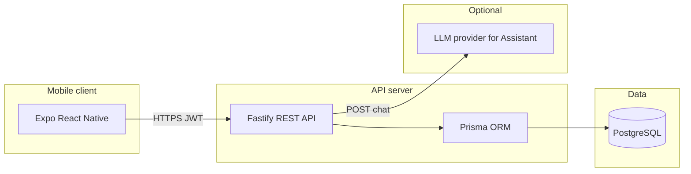

# OpenClass — Lecture Room & Scheduling Platform

A full-stack campus system for **exploring buildings and rooms**, **managing course offerings**, **booking lecture slots** with conflict checks, **role-based access** (administrators, teachers, students, and class representatives), **in-app notifications**, and an **AI Campus Assistant** that answers questions using live data from your account.

---

## Team — Dunder Mifflin

| | |
|---|---|
| **Group name** | **Dunder Mifflin** |
| **Members** | 1. **Abel Sisay** · 2. **Edmon Dejen** |

---

## Table of contents

- [Overview](#overview)
- [What the system does](#what-the-system-does)
- [Architecture](#architecture)
- [Repository layout](#repository-layout)
- [Technology stack](#technology-stack)
- [Domain model](#domain-model)
- [User roles](#user-roles)
- [Mobile application](#mobile-application)
- [API overview](#api-overview)
- [Campus Assistant (AI)](#campus-assistant-ai)
- [Getting started](#getting-started)
- [Environment variables](#environment-variables)
- [Data import templates](#data-import-templates)
- [Security & operations](#security--operations)

---

## Overview

The platform connects a **PostgreSQL** database, a **Node.js REST API** (Fastify), and a **cross-platform mobile app** (Expo / React Native). It is designed for universities or departments that need a single source of truth for **rooms**, **academic years**, **catalog courses**, **per-term offerings**, **class-representative (CR) cohorts**, and **time-based room bookings** with reminders and optional room-availability alerts.

---

## What the system does

| Area | Capabilities |
|------|----------------|
| **Campus map** | Browse buildings and rooms; search rooms; see live-style availability hints (green / yellow / red) from current bookings. |
| **Scheduling** | Create and manage bookings linked to **course offerings**, with event types (lecture, lab, exam, etc.), time ranges, and overlap protection. |
| **Courses** | Separate **catalog courses** (name/code) from **course offerings** (a specific run: academic year, department, year level, section, assigned teacher). |
| **Class representatives** | Students with an active **CR assignment** can manage cohort offerings and book rooms for their section’s offerings (within policy). |
| **Teachers** | See offerings they teach; book for those offerings with appropriate event types. |
| **Administrators** | Broad CRUD: users, faculties, departments, academic years, buildings, rooms, catalog, offerings, CR assignments, bulk-friendly flows. |
| **Notifications** | Booking-related notifications (e.g. advance reminders, class start, cutoff warnings, cancellations). |
| **Room alerts** | Users can subscribe to alerts for a room for a limited window. |
| **Policy** | Server-driven values such as **cutoff minutes** before class and **advance reminder hours** (used by notifications and exposed to clients). |
| **Assistant** | Authenticated **Campus Assistant** chat: answers about schedule, policy, rooms, and org structure using **read-only tools** over your data. |

---

## Architecture



---

## Repository layout

| Path | Purpose |
|------|---------|
| `server/` | API source, Prisma schema, seed script, TypeScript build output to `dist/`. |
| `lecture-room-status/` | Expo (React Native) app — primary end-user UI. |
| `docker-compose.yml` | PostgreSQL + API container orchestration. |
| `csv-templates/` | Sample CSV layouts aligned with bulk/admin workflows. |
| `.env` (root) | Used by Docker Compose for DB password, JWT, API port, CORS, optional LLM keys (**gitignored**). |

---

## Technology stack

| Layer | Technologies |
|-------|----------------|
| **API** | Node.js 20+, Fastify 5, `@fastify/jwt`, `@fastify/cors`, Zod validation |
| **Database** | PostgreSQL 16, Prisma 6 |
| **Mobile** | Expo ~55, Expo Router, React Native, Secure Store for tokens |
| **Containers** | Docker Compose (`postgres:16-alpine`, API image built from `server/Dockerfile`) |

---

## Domain model

- **Faculty → Department** — Organizational hierarchy; users and offerings attach to departments.
- **Academic year** — Named period with start/end; one can be marked **active** for current operations.
- **Course (catalog)** — Reusable definition (course name, optional code).
- **Course offering** — Instance of a catalog course for a given **academic year**, **department**, **year level**, optional **section**, optional **teacher**, and optional **CR-created** metadata.
- **User** — `student`, `teacher`, or `admin`; profile includes faculty/department/year/section where applicable.
- **CR assignment** — Links a **student** to a cohort (department + year + section) for an academic year; enables cohort-scoped booking rules.
- **Building & room** — Physical inventory: capacity, floor, type, amenities (projector, network, etc.), optional equipment JSON.
- **Booking** — Room + offering + time window + event type + status (`booked` / `cancelled`); drives notifications.
- **Notifications & room alert subscriptions** — Per-user messaging and time-bound room watchlists.

---

## User roles

| Role | Typical use |
|------|-------------|
| **Student** | View own profile and class list; see bookings they booked or that belong to their CR cohort; room search and explore; notifications; Assistant. |
| **Teacher** | Offerings they teach; bookings for those offerings; booking rules for teacher event types; Assistant. |
| **Admin** | Full structure and user management; offerings and CR assignments; campus-wide booking visibility; extra Assistant tools (e.g. academic years, aggregates). |

*Class representatives are **students** with an active **CR assignment** for the current academic year — not a separate login role.*

---

## Mobile application

Tab-based **Expo Router** app (see `lecture-room-status/app/(app)/(tabs)/`):

| Area | Description |
|------|-------------|
| **Explore** | Buildings, rooms, search, QR flow where configured. |
| **Schedule** | Personal and role-relevant booking flows (including CR setup where applicable). |
| **Assistant** | Campus Assistant chat: suggested prompts by role, persisted thread (local), calls `POST /ai/chat` with JWT. |
| **Alerts** | Notification inbox. |
| **Profile** | Account summary and sign-out. |
| **Admin** | Visible only for `admin` — management screens for campus data. |

Configure the API base URL via `EXPO_PUBLIC_API_URL` (see `lecture-room-status/.env.example`). Use your machine’s **LAN IP** when testing on a physical device, not `localhost`.

---

## API overview

All business routes (except health and AI ping) expect **`Authorization: Bearer <JWT>`** after login.

| Prefix | Responsibility |
|--------|----------------|
| `/health` | Liveness / readiness style checks |
| `/auth` | Sign-in, token, profile |
| `/buildings`, `/rooms` | Campus inventory and search |
| `/bookings` | List and create/update bookings with role rules |
| `/courses` | My classes, bookable offerings, offering CRUD (CR/admin flows) |
| `/admin` | Administrative bulk and entity management |
| `/notifications` | User notifications |
| `/settings` | Public policy values (e.g. cutoff, reminder hours) |
| `/room-alerts` | Room alert subscriptions |
| `/structure` | Faculties and departments |
| `/ai` | `GET /ai` — capability ping; `POST /ai/chat` — Campus Assistant (requires LLM env configuration) |

---

## Campus Assistant (AI)

- **Endpoint:** `POST /ai/chat` with JSON body `{ "messages": [...], "client_context"?: { "screen", "platform" } }`.
- **Behavior:** Server injects a **session brief** (user snapshot, active year, class-rep cohort if any, policy numbers) and a **structured system prompt**; the model may call **read-only tools** (bookings, offerings, rooms, catalog search, notifications, org structure, etc.). Admin-only tools are gated by role.
- **Configuration:** Set `OPENROUTER_API_KEY` and optional model / app title in environment (see `server/.env.example`). **Never commit real API keys** — use `.env` locally and CI secrets in automation.
- **Example script:** `server/scripts/ai-chat-example.sh` (documented in `server/.env.example`).

---

## Getting started

### Prerequisites

- Docker & Docker Compose **or** Node.js 20+, PostgreSQL, and npm
- For the mobile app: Node.js, npm, Expo CLI / `npx expo`

### Option A — Docker (API + database)

1. Copy and edit root `.env` (see [Environment variables](#environment-variables)).
2. From the repository root:

   ```bash
   docker compose up --build
   ```

3. Apply schema and seed (as needed):

   ```bash
   docker compose exec api npx prisma db push
   docker compose exec api npx tsx prisma/seed.ts
   ```

4. API listens on `http://localhost:${API_PORT:-3000}`.

### Option B — Local API

1. Create `server/.env` from `server/.env.example` and set `DATABASE_URL`, `JWT_SECRET` (≥32 chars), etc.
2. In `server/`:

   ```bash
   npm install
   npx prisma generate
   npx prisma db push
   npm run db:seed   # optional
   npm run dev
   ```

### Mobile app

1. In `lecture-room-status/`, copy `.env.example` to `.env` and set `EXPO_PUBLIC_API_URL` to your API URL (host reachable from the device).
2. Run:

   ```bash
   cd lecture-room-status
   npm install
   npx expo start
   ```

---

## Environment variables

| Location | Variables (high level) |
|----------|-------------------------|
| **Root `.env`** | `POSTGRES_PASSWORD`, `JWT_SECRET`, `API_PORT`, `CORS_ORIGIN`, optional `OPENROUTER_*` for Docker API service |
| **`server/.env`** | `DATABASE_URL`, `JWT_SECRET`, `PORT`, `HOST`, `CUTOFF_MINUTES`, `ADVANCE_REMINDER_HOURS`, optional `OPENROUTER_*` |
| **`lecture-room-status/.env`** | `EXPO_PUBLIC_API_URL` |

See `server/.env.example` and `lecture-room-status/.env.example` for templates.

---

## Data import templates

Under `csv-templates/` you will find CSV layouts intended to align with administrative bulk operations (e.g. students, courses, course offerings). Use them as **structure guides**; exact import paths are implemented in the admin API and app screens.

---

## Security & operations

- **Secrets:** Keep `.env` out of version control; rotate any key that was ever committed or pasted into a public channel.
- **JWT:** Use a long, random `JWT_SECRET` in production.
- **CORS:** Restrict `CORS_ORIGIN` to known web origins when exposing the API to browsers; mobile apps may use `*` in development with care.
- **Database:** Back up `pgdata` volume (Docker) or your managed PostgreSQL instance regularly.
- **Assistant:** Rate limiting is applied per user on the chat endpoint; prefer a dedicated model / quota policy in production.

