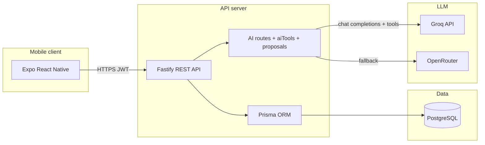

# OpenClass - Lecture Room & Scheduling Platform

**OpenClass** is built for a problem spreadsheets and generic “facility management” tools rarely solve well: **what is happening in each room right now, who it belongs to next, and whether students and teachers are acting on the same live room state**, across a whole campus, on a phone, without calling the office or walking every floor.

On one **mobile-first** surface, people see **buildings and floors**, **room-level status** (free / class soon / in session), and **real bookings** tied to **courses and cohorts** - not just a static room list. **Teachers and class representatives** reserve rooms against **actual offerings** with **overlap protection**; **students** see **their** schedule context, get **timely nudges** (reminders, cutoffs, cancellations), and can **watch a room** when they need to know what is coming. **Admins** keep the org, inventory, and access model honest so the live picture stays trustworthy. The point is **operational clarity in the hallway**, not another back-office form factory.

**Campus Assistant (the AI agent)** is **not** a generic FAQ or “chatbot” that guesses from static text. It is an **authenticated, server-orchestrated agent**: each reply can trigger **real API-style tools** against **your live database** (bookings, rooms, offerings, policy, org structure, and more - scoped exactly like the REST API). The model **plans and calls tools in a loop** until it has grounded answers; for anything that changes data (bookings, notification state, room-alert subscriptions), it only creates a **time-bound proposal** that you **Confirm** or **Cancel** in the app - so nothing sensitive is applied from chat alone. The same JWT and **role rules** apply as everywhere else in the product.

---

## Team - Dunder Mifflin

| | |
|---|---|
| **Group name** | **Dunder Mifflin** |
| **Members** | 1. **Abel Sisay** · 2. **Edmon Dejen** |

---

## Table of contents

- [Overview](#overview)
- [What the system does](#what-the-system-does)
- [Architecture](#architecture)
- [Repository layout](#repository-layout)
- [Technology stack](#technology-stack)
- [Domain model](#domain-model)
- [User roles](#user-roles)
- [Mobile application](#mobile-application)
- [API overview](#api-overview)
- [Campus Assistant (AI)](#campus-assistant-ai)
- [Demo data & Docker bootstrap](#demo-data--docker-bootstrap)
- [Getting started](#getting-started)
- [Environment variables](#environment-variables)
- [Data import templates](#data-import-templates)
- [Security & operations](#security--operations)
- [Further documentation](#further-documentation)

---

## Overview

The platform connects a **PostgreSQL** database, a **Node.js REST API** (Fastify), and a **cross-platform mobile app** (Expo / React Native). It targets universities or departments that need a single source of truth for **rooms**, **academic years**, **catalog courses**, **per-term offerings**, **class-representative (CR) cohorts**, and **time-based room bookings** with reminders and optional room-availability alerts.

**How the assistant is implemented (technical):** the API exposes **structured tool definitions** (OpenAI-compatible function calling), runs a **multi-round tool loop** (up to six model rounds per request), and prepends a **session brief** (user snapshot, active academic year, class-rep cohort if any, policy numbers, optional **client context** from the phone such as current route or room id). Write-capable tools return **proposals** stored server-side until **`POST /ai/confirm`**, so the LLM never bypasses validation or role checks.

---

## What the system does

| Area | Capabilities |
|------|----------------|
| **Campus map** | Browse buildings and rooms; search rooms; live-style availability hints (green / yellow / red) from current bookings. |
| **Scheduling** | Create and manage bookings linked to **course offerings**, with event types (lecture, lab, exam, etc.), time ranges, and overlap protection. |
| **Courses** | Separate **catalog courses** (name/code) from **course offerings** (a specific run: academic year, department, year level, section, assigned teacher). |
| **Class representatives** | Students with an active **CR assignment** can manage cohort offerings and book rooms for their section’s offerings (within policy). |
| **Teachers** | See offerings they teach; book for those offerings with appropriate event types. |
| **Administrators** | Broad CRUD: users, faculties, departments, academic years, buildings, rooms, catalog, offerings, CR assignments, bulk-friendly flows. |
| **Notifications** | Booking-related notifications (advance reminders, class start, cutoff warnings, cancellations). |
| **Room alerts** | Users can subscribe to alerts for a room for a limited window. |
| **Policy** | Server-driven values such as **cutoff minutes** before class and **advance reminder hours** (used by notifications, Assistant answers, and clients). |
| **Campus Assistant** | Authenticated chat: **read tools** (bookings, offerings, rooms, buildings, catalog, notifications, org structure, availability checks, admin stats). **Write paths** use **proposals** (create/cancel booking, mark notifications read, room-alert subscribe/cancel) confirmed via **`POST /ai/confirm`**. Tools and proposals are **role-gated** to match HTTP routes. |

---

## Architecture



---

## Repository layout

| Path | Purpose |
|------|---------|
| `server/` | API source, Prisma schema, TypeScript build to `dist/`. |
| `server/prisma/seed.ts` | Full idempotent TypeScript seed (hackathon demo dataset). |
| `server/prisma/ensure-demo-campus.mjs` | Node script: buildings, rooms, active academic year (no `tsx`). |
| `server/prisma/ensure-demo-schedule.mjs` | Node script: faculties/departments, demo teachers/CRs, courses, offerings, bookings (depends on rooms). |
| `server/prisma/reset-demo-passwords.mjs` | Normalizes bcrypt + `isActive` for demo IDs; ensures **HACKADM001** / **HACKSTU001** exist with profile hints for schedule APIs. |
| `server/scripts/prisma-with-env.mjs` | Loads `server/.env` for local `db push` / `db seed` / migrate commands. |
| `lecture-room-status/` | Expo (React Native) app - primary end-user UI. |
| `docker-compose.yml` | PostgreSQL + API containers. |
| `csv-templates/` | Sample CSV layouts for bulk/admin workflows. |
| `.env` (root) | Docker Compose: DB password, JWT, API port, CORS, optional LLM keys (**gitignored**). |

---

## Technology stack

| Layer | Technologies |
|-------|--------------|
| **API** | Node.js 20+, Fastify 5, `@fastify/jwt`, `@fastify/cors`, Zod validation |
| **Database** | PostgreSQL 16, Prisma 6 |
| **Mobile** | Expo ~55, Expo Router, React Native, Secure Store for tokens |
| **Assistant LLM** | **Groq** (preferred if `GROQ_API_KEY` is set) or **OpenRouter** (`OPENROUTER_API_KEY`); OpenAI-compatible chat completions with **tool calling** |
| **Containers** | Docker Compose (`postgres:16-alpine`, API image from `server/Dockerfile`, Debian-based Node image for reliable Prisma engines) |

---

## Domain model

- **Faculty → Department** - Organizational hierarchy; users and offerings attach to departments.
- **Academic year** - Named period with start/end; one can be marked **active** for current operations.
- **Course (catalog)** - Reusable definition (course name, optional code).
- **Course offering** - Instance of a catalog course for a given **academic year**, **department**, **year level**, optional **section**, optional **teacher**, and optional **CR-created** metadata.
- **User** - `student`, `teacher`, or `admin`; profile includes faculty/department/year/section where applicable.
- **CR assignment** - Links a **student** to a cohort (department + year + section) for an academic year; enables cohort-scoped booking rules.
- **Building & room** - Physical inventory: capacity, floor, type, amenities (projector, network, etc.), optional equipment JSON.
- **Booking** - Room + offering + time window + event type + status (`booked` / `cancelled`); drives notifications.
- **Notifications & room alert subscriptions** - Per-user messaging and time-bound room watchlists.
- **AssistantProposal** - Server-side record of a pending **confirmed** action (TTL); linked to the user who initiated it.

---

## User roles

| Role | Typical use |
|------|-------------|
| **Student** | Profile and class list; cohort-related visibility when a CR; room explore; notifications; Assistant (read + proposal flow for allowed actions). |
| **Teacher** | Offerings they teach; bookings for those offerings; Assistant. |
| **Admin** | Full structure and user management; offerings and CR assignments; campus-wide visibility; Assistant including admin-only read tools (e.g. booking stats, academic years). |

*Class representatives are **students** with an active **CR assignment** for the current academic year - not a separate login role.*

---

## Mobile application

Tab-based **Expo Router** app (see `lecture-room-status/app/(app)/(tabs)/`):

| Area | Description |
|------|-------------|
| **Explore** | Buildings, rooms, search, QR flow where configured. |
| **Schedule** | Personal and role-relevant bookings and class lists (including CR flows where applicable). |
| **Assistant** | Campus Assistant: suggested prompts by role, **persisted thread** (AsyncStorage), `POST /ai/chat` with JWT. Sends **`client_context`** (route, optional room/building/booking ids, platform, timezone) so answers can be grounded to the screen the user is on. **Confirm / Cancel** chips for proposals; deep links where relevant. |
| **Alerts** | Notification inbox. |
| **Profile** | Account summary and sign-out. |
| **Admin** | Visible only for `admin` - management screens for campus data. |

**UX:** Login, change-password, and Assistant composer use **keyboard-aware** layouts (scroll, safe header offset on iOS, Android **`softwareKeyboardLayoutMode: resize`** in `lecture-room-status/app.json`) so fields are not covered by the software keyboard.

Configure the API base URL via `EXPO_PUBLIC_API_URL` (see `lecture-room-status/.env.example`). On a **physical device**, use your machine’s **LAN IP**, not `localhost`.

---

## API overview

All business routes (except health and Assistant ping) expect **`Authorization: Bearer <JWT>`** after login.

| Prefix | Responsibility |
|--------|----------------|
| `/health` | Liveness / readiness style checks |
| `/auth` | Sign-in, token, profile, password change |
| `/buildings`, `/rooms` | Campus inventory and search |
| `/bookings` | List and create/update bookings with role rules |
| `/courses` | My classes, bookable offerings, offering CRUD (CR/admin flows) |
| `/admin` | Administrative bulk and entity management |
| `/notifications` | User notifications |
| `/settings` | Public policy values (e.g. cutoff, reminder hours) |
| `/room-alerts` | Room alert subscriptions |
| `/structure` | Faculties and departments |
| `/ai` | `GET /ai` - capability ping; `POST /ai/chat` - Assistant chat (LLM + tools); `POST /ai/confirm` - confirm or cancel a **proposal** (`proposal_id`, optional `confirmed: false` to cancel) |

---

## Campus Assistant (AI)

### Providers and configuration

- **Groq** is used when **`GROQ_API_KEY`** is set (default model in `.env.example`: `llama-3.3-70b-versatile`). The model must support **tool calling**.
- Otherwise **OpenRouter** is used when **`OPENROUTER_API_KEY`** is set (`OPENROUTER_MODEL`, optional referer/title headers).
- If neither key is set, `POST /ai/chat` returns **503** with a clear configuration message.

Never commit real API keys. Use `.env` / Compose env and CI secrets only.

### Request shape

- **`POST /ai/chat`** - Body: `{ "messages": [ { "role": "user"|"assistant", "content": "..." } ], "client_context"?: { ... } }`.
- **`client_context`** (optional): `screen`, `platform`, `route`, `room_id`, `building_id`, `booking_id`, `timezone` - merged into the server **session brief** so the model can disambiguate “this room” or “today” correctly.

### Server behavior

1. **Rate limit:** Per user, **30 requests per minute** (sliding window).
2. **Prompting:** System prompt (domain glossary, role playbooks, tool discipline) plus a second system message with **JSON session brief** (user snapshot, active year, CR cohort, policy numbers).
3. **Tools:** The model receives OpenAI-style **function definitions** filtered by **role** (e.g. admin-only tools omitted for students). Tools cover profile, policy, bookings (including filtered and offering-scoped lists), buildings/rooms (search, list-by-building, advanced search, availability checks, details), catalog search, notifications, room alerts, org structure, and **propose_*** tools for mutations.
4. **Tool loop:** Up to **6** LLM rounds per chat request; each round may execute multiple tool calls. If the model never returns user-facing text, a fallback message is returned.
5. **Writes:** Mutations go through **proposals** stored in the database (`AssistantProposal`). The chat response may include `proposal` + `suggested_actions` (Confirm / Cancel). The client calls **`POST /ai/confirm`** with `{ "proposal_id" }` to apply, or `{ "proposal_id", "confirmed": false }` to cancel. Expired proposals are rejected.

### Scripts

- **`server/scripts/ai-chat-example.sh`** - Example `curl` for `/ai/chat` (set `API_URL` and JWT).
- **`server/scripts/ai-v2-scenarios.sh`** - Scenario-style checks for buildings, time windows, role rules, and confirm idempotency (see comments in script).

---

## Demo data & Docker bootstrap

The API **Docker image** startup command (see `server/Dockerfile`) runs, in order:

1. `npx prisma db push`
2. `npx prisma db seed` (TypeScript seed via `tsx` - idempotent upserts)
3. `node prisma/ensure-demo-campus.mjs` - guarantees **buildings + rooms + active year** even if the TS seed step fails in constrained environments
4. `node prisma/ensure-demo-schedule.mjs` - guarantees **faculties/departments, demo teachers/CRs, courses, offerings, bookings** (requires rooms)
5. `node prisma/reset-demo-passwords.mjs` - bcrypt + `isActive` for demo IDs; ensures **HACKSTU001** has department/year/section when SE data exists so **`/courses/my-classes`** works

**Local npm helpers** (from `server/` with `DATABASE_URL` set):

| Script | Command |
|--------|---------|
| Ensure campus | `npm run demo:ensure-campus` |
| Ensure schedule | `npm run demo:ensure-schedule` |
| Reset demo passwords | `npm run demo:reset-passwords` |
| DB with `.env` | `npm run db:push`, `npm run db:seed` |

### Demo accounts (hackathon-style)

Password for the seeded hackathon demo users: **`Hackathon2026`**

| ID | Role / notes |
|----|----------------|
| **HACKADM001** | Admin |
| **HACKSTU001** | Student (SE, year 5, section A - schedule tab uses this profile) |
| **HACKTCH001**-**003** | Teachers |
| **HACKCR001**-**002** | Students with CR assignments |

Legacy demo IDs (**ADMIN001**, **STU001**, etc.) may still exist when the full seed runs; see `server/prisma/seed.ts` and `reset-demo-passwords.mjs` for the full list.

---

## Getting started

### Prerequisites

- Docker & Docker Compose **or** Node.js 20+, PostgreSQL, and npm
- For the mobile app: Node.js, npm, Expo / `npx expo`
- For the Assistant: **Groq** and/or **OpenRouter** API key in the API environment

### Option A - Docker (API + database)

1. Copy and edit root `.env` (see [Environment variables](#environment-variables)); set **`JWT_SECRET`** (≥32 characters) and **`POSTGRES_PASSWORD`**.
2. Optionally set **`GROQ_API_KEY`** or **`OPENROUTER_API_KEY`** in the same file so Compose passes them into the `api` service.
3. From the repository root:

   ```bash
   docker compose up --build
   ```

4. On first boot, the container applies schema, seed, and the **ensure/reset** scripts above. For an already-running volume, you can re-run ensure scripts manually:

   ```bash
   docker compose exec api node prisma/ensure-demo-campus.mjs
   docker compose exec api node prisma/ensure-demo-schedule.mjs
   docker compose exec api node prisma/reset-demo-passwords.mjs
   ```

5. API listens on `http://localhost:${API_PORT:-3000}`.

### Option B - Local API

1. Create `server/.env` from `server/.env.example` and set `DATABASE_URL`, `JWT_SECRET` (≥32 chars), and optional LLM keys.
2. In `server/`:

   ```bash
   npm install
   npx prisma generate
   npm run db:push
   npm run db:seed
   npm run demo:ensure-campus
   npm run demo:ensure-schedule
   npm run demo:reset-passwords
   npm run dev
   ```

### Mobile app

1. In `lecture-room-status/`, copy `.env.example` to `.env` and set `EXPO_PUBLIC_API_URL` to your API URL (host reachable from the device).
2. Run:

   ```bash
   cd lecture-room-status
   npm install
   npx expo start
   ```

**Rebuild native Android** after changing `app.json` keyboard layout (prebuild / dev client), so `softwareKeyboardLayoutMode` applies.

---

## Environment variables

| Location | Variables (high level) |
|----------|-------------------------|
| **Root `.env`** | `POSTGRES_PASSWORD`, `JWT_SECRET`, `API_PORT`, `CORS_ORIGIN`, optional **`GROQ_*`** / **`OPENROUTER_*`** for the API container |
| **`server/.env`** | `DATABASE_URL`, `JWT_SECRET`, `PORT`, `HOST`, `CUTOFF_MINUTES`, `ADVANCE_REMINDER_HOURS`, optional **`GROQ_*`** / **`OPENROUTER_*`** |
| **`lecture-room-status/.env`** | `EXPO_PUBLIC_API_URL` |

See `server/.env.example` and `lecture-room-status/.env.example` for templates.

---

## Data import templates

Under `csv-templates/` you will find CSV layouts intended to align with administrative bulk operations (e.g. students, courses, course offerings). Use them as **structure guides**; exact import paths are implemented in the admin API and app screens.

---

## Security & operations

- **Secrets:** Keep `.env` out of version control; rotate any key that was ever committed or pasted into a public channel.
- **JWT:** Use a long, random `JWT_SECRET` in production.
- **CORS:** Restrict `CORS_ORIGIN` to known web origins when exposing the API to browsers; mobile apps may use `*` in development with care.
- **Database:** Back up `pgdata` volume (Docker) or your managed PostgreSQL instance regularly.
- **Assistant:** Per-user rate limit on chat; proposals expire after a short TTL; confirm endpoint re-validates role and payload. Use a dedicated model / quota policy in production.

---

## Further documentation

- **`LECTURE_ROOM_STATUS_SYSTEM_DOCUMENTATION.md`** - Product and workflow specification (roles, room lifecycle, booking rules, UI expectations).
- **`lecture-room-status/README.md`** - Mobile-focused quick start and project tree.
